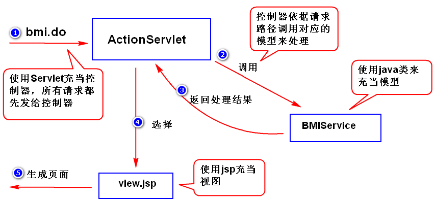

# SSM
Spring SpringMVC Mybatis  

---
## 系统分层
- 上一层调用接口调用下一层的服务，这样做的好处是，当下一层的实现发生改变，不影响上一层
1. 表示层：UI层，数据展现和操作界面，另外还要负责请求分发
2. 业务层：服务层，封装业务处理逻辑
3. 持久层：数据访问层，封装数据访问逻辑
---
## MVC
<br/>
- 软件开发过程中的设计思想，是表示层的一种架构模式
1. Model：封装应用程序的数据结构和事务逻辑，集中体现应用程序的状态
2. View：是 Model 的外在表现，负责提供界面 (JSP)
3. Controller：负责协调模型和视图 (Servlet)
>### 好处
>1. 方便测试，业务逻辑写在java可直接测试
>2. 方便维护，修改视图、模型，互不影响
>3. 方便分工协作
---
## Spring
- 解决企业应用开发的复杂性，让J2EE开发更简单
>### Spring 优点:
>1. 轻量级：相对于 EJB 这种重量级的容器而言，Spring 的 IOC 是完全不依赖底层容器，零侵入性的设计。便于开发测试，Spring 部署方便，而且可以运行在任何 J2EE 支持的容器上或 APP 中
>2. 控制反转：Spring 使用控制反转技术实现了松耦合，依赖被注入到对象，而不是创建或寻找依赖对象
>3. 面向切面：解决了面向对象中不足，它将那些影响多个类的行为封装到可重用的模块中，面向对象是把问题从同类事物中抽象出来，面向切面是把问题从不同类问题中抽象出来
>4. 异常处理：由于 Java 的 JDBC，Hibernate 等 API 中有很多方法抛出的是 checked exception，而很多开发者并不能很好的处理异常。Spring 提供了统一的 API 将这些 checked exception 的异常转换成 Spring 的 unchecked exception
>5. Spring MVC：Spring 实现了一个自己的 MVC 框架，性能优越很高，可以替换 struts2，而且无需要考虑与 spring 整合问题
>6. 高度开放性：不强制应用完全依赖于 Spring，开发者可自由选用 Spring 框架的部分或全部
>7. 事务管理：Spring 强大的事务管理功能，支持声明事务和编程事务，能够处理本地事务(一个数据库)或是全局事务
>### Spring 容器
>1. BeanFactory：负责读取 bean 配置文档，管理 bean 的加载，实例化，维护 bean 之间的依赖关系，负责 bean 的声明周期
>2. ApplicationContext：是 BeanFactory 子接口，它提供了比 BeanFactory 更完善的功能
>       1. 继承 MessageSource 接口，因此提供国际化支持
>       2. 资源访问
>       3. 事件机制
>       4. 载入多个配置文件
>       5. 以声明式的方式启动，并创建 Spring 容器
>3. FileSystemXmlApplicationContext：是 ApplicationContext 的子孙类，基于文件系统的 XML 配置文件创建
>4. ClassPathXmlApplicationContext：是 ApplicationContext 的子孙类，以类加载路径下的 XML 配置文件创建
>>#### 启动容器实例：
>>```
>>ApplicationContext ac = new ClassPathXmlApplicationContext("spring/spring-service.xml", "spring/spring-aop.xml");
>>```
>### Spring 实例化 Bean
>1. 无参构造器
>```
>   <bean id="gregorianCalendar" class="java.util.GregorianCalendar"/>
>```
>2. 工厂静态方法
>```
>   <bean id="calendar" class="java.util.Calendar" factory-method="getInstance"/>
>```
>3. 工厂实例方法
>```
>   <bean id="gregorianCalendar" class="java.util.GregorianCalendar"/>
>   <bean id="time" factory-bean="calendar" factory-method="getTime"/>
>```
>### Spring IOC 和 DI
>1. IOC：对象之间的依赖关系由容器来建立，IOC 是目的
>2. DI：容器调用 set() 或构造器来建立对象之间的依赖关系，DI 是手段
>       1. set 注入
>       ```
>       <bean id="date" class="java.util.Date"/>
>       <bean id="student" class="l.demo.Person.Student">
>           <property name="birth" ref="date"/>
>       </bean>
>       ```
>       2. 构造器注入
>       ```
>       <bean id="student2" class="l.demo.Person.Student">
>           <constructor-arg index="0" value="1"/>
>           <constructor-arg index="1" value="张三"/>
>       </bean>
>       ```
>       3. p 命名空间注入：和 set 注入原理一样，都是通过 setter 给属性赋值
>       ```
>       <bean id="student3" class="l.demo.Person.Student" p:id="1" p:name="张三"/>
>       ```
>       4. 自动装配 (autowire)
>           1. no：默认值，禁用自动装配
>           2. byName：根据属性名自动装配
>           3. byType：根据属性类型自动装配
>           4. constructor：与 byType 类似，应用于构造函数
>           5. autodetect：通过 bean 类来决定使用 byType 还是 constructor。如果发现默认的构造器，将使用 byType
>### Spring 参数注入
>1. 基本类型：&lt;property name="age" value="18"/&gt;
>       - 字段属性为 org.springframework.core.io.Resource 时，value="classpath:mybatis-config.xml"
>2. 集合类型：&lt;list/&gt; &lt;set/&gt; &lt;map/&gt; &lt;props/&gt; 或 ref
>       ```
>           <bean id="person" class="l.demo.Person">
>               <property name="otherInfo">
>                   <list>
>                       <value>父亲</value>
>                       <value>医生</value>
>                   </list>
>               </property>
>           </bean>
>           
>           <util:properties location="classpath:jdbc.properties" id="jdbc"/>
>           <bean id="properties" class="spring.demo.bean.SpringBeanDemo.Bean">
>               <property name="properties" ref="jdbc"/>
>           </bean>
>       ```
>3. Bean：ref
>4. null：&lt;property name="age"&gt; &lt;null/gt; &lt;/property&gt;
>5. Spring 表达式：#{...}，读取其它对象/集合中的数据
>### Spring 其它功能
>- init-method：初始化方法
>- destroy-method：销毁方法
>- scope：作用域
>   1. singleton：单例，缺省值
>   2. prototype：多实例，Spring 初始化时不会实例化
>   3. request：
>   4. session：
>- lazy-int：延迟加载，如果值为 true，即使 scope="singleton" 也不会加载
>### Spring 基于注解的组件扫描
>- 组件扫描：容器启动之后，会扫描指定的包及其子包下面的所有的类，如果该类前面有一些特定的注解（比如 @Component），则容器会将该类纳入容器进行管理（相当于在配置文件里面有一个 bean）
>- 步骤：
>   1. 配置文件：<context:component-scan base-package="com.*"/>
>   2. 类前面添加注解：
>       - @Component：通用注解，默认生成 id 为小写开头的类型，和 @Autowired 一起使用
>       - @Named：通用注解，默认生成 id 为小写开头的类型，和 @Inject 一起使用
>       - @Repository：持久化层组件注解
>       - @Service：业务层组件注解
>       - @Controller：控制层组件注解
>- 依赖注入注解：
>   1. @Autowired：写在构造器前面，声明需要为其注入 Bean
>   2. @Inject：写在构造器前面，声明需要为其注入 Bean
>   3. @Qualifier：写在参数前面，声明需要注入的 bean 的 id 值
>       - 当创建相同类型的 Bean 时，和 @Autowired 配合使用
>       - 注入的对象为单例时，可省略 value，此时，Spring 按照类型匹配
>   4. @Resource：set 方法注入推荐使用
>       - 可省略 value，此时，Spring 按照类型匹配
>   - 把注解写在成员变量前，会利用 Java 反射机制来对属性赋值
>- 其它注解：
>   - @Scope("prototype")：指定作用域，写在类前
>   - @Lazy(true)：延迟加载，写在类前
>   - @PostConstruct @PreDestroy：指定初始化方法和销毁方法
>   - @Value("#{config.max-wait}")：写在成员变量前或 set 方法前
>### Spring MVC
>- 用来简化基于 MVC 架构的 WEB 应用程序开发的框架，是 Spring 框架的一部分
>
><br/>
>#### 基于XML配置 MVC
>>1. 搭建环境：
>>      1. 创建 web 工程，导包 spring-webmvc
>>      2. 添加 xml 配置文件
>>      3. 在 web.xml 配置 DispatcherServlet 前端控制器
>>      ```
>>          <servlet>
>>              <servlet-name>spring</servlet-name>
>>              <servlet-class>org.springframework.web.servlet.DispatcherServlet</servlet-class>
>>              <init-param>
>>                  <param-name>contextConfigLocation</param-name>
>>                  <param-value>classpath:spring/spring-web.xml</param-value>
>>              </init-param>
>>          </servlet>
>>      ```
>>2. HandlerMapping：通过此组件，Dispatcher 可将客户 HTTP 请求映射到 Controller 上
>>      1. SimpleUrlHandlerMapping
>>      ```
>>          <bean class="org.springframe.web.servlet.handler.SimpleUrlHandlerMapping">
>>              <property name="mappings">
>>                  <props>
>>          　           <prop key="/hello.do">hc</prop>
>>                  </props>
>>          　   </property>
>>          </bean>
>>      ```    
>>      2. BeanNameUrlHandlerMapping
>>      3. RequestMappingHandlerMapping
>>3. Controller：负责执行具体的业务处理，实现 Controller 接口及约定方法 handleRequest(req, resp)
>>      ```
>>          <bean id="hc" class="controller.HelloController"/>
>>      ```
>>4. ModelAndView：handlerRequest() 返回一个 ModelAndView 对象，该对象可封装模型数据和视图名相应信息
>       - ModelAndView(String ViewName); 或 ModelAndView(String viewName, Map model);
>>5. ViewResolver：
>>      1. UrlBasedViewResolver
>>      2. InternalResourceViewResolver
>>      ```
>>          <bean class="org.springframework.web.servlet.view.InternalResourceViewResolver">
>>              <property name="prefix" value="/WEB-INF/views/"/>
>>              <property name="suffix" value=".jsp"/>
>>          </bean>
>>      ```           
>>      3. XmlViewResolver
>>      4. FreeMarkerViewResolver
>#### 基于注解配置的 MVC
>>1. 添加注解驱动：<mvc:annotation-driven />
>>      1. 自动注册：HandlerMapping，HandlerAdapter，HandlerExceptionResolver
>>      2. 其它扩展功能
>>2. 添加包扫描：<context:component-scan base-package="spring.web"/>
>>3. @Controller：用于组件扫描，Controller 不用实现 Controller 接口了
>>4. @RequestMapping：相当于 HandlerMapping
>>5. ViewResolver：同基于 XML 配置
>### Spring 获取请求参数
>1. 通过 HttpServletRequest 对象：
>       - request.getParameter(x), request.getParameterMap();
>2. 通过 @RequestParam：参数类型自动转换，但可能出现类型转换异常
>       - public String bmi(@RequestParam("height") String h, String weight);
>3. 通过 JavaBean：封装请求参数，属性名与请求参数名要一致，类型要一致
>### Spring 向页面传值
>1. 通过 HttpServletRequest 对象：
>       - request.setAttribute(String name, Object obj);
>2. 通过 HttpSession 对象：
>       - session.setAttribute(String name, Object obj);
>3. 通过 ModelAndView 对象：
>       ```
>       Map<String, Object> data = new HashMap<String, Object>();
>       data.put("status", status);
>       return ModelAndView(String viewName, Map data);
>       ```
>4. 通过 ModelMap 对象：
>       ```
>       public String bmi(BmiParam bp, ModelMap modelMap) {
>           ...
>           modelMap.put("status", status);
>           return viewName;
>       }
>       ```
>5. 通过 [@ModelAttribute](https://www.4spaces.org/spring-mvc-and-the-modelattribute-annotation/)
>### Spring 重定向
>- SpringMVC 默认采用转发方式定位视图，可依据返回值类型分别采用以下方法
>   1. ModelAndView：RedirectView view = new RedirectView("hello.do"); return new ModelAndView(view);
>   2. String：return "redirect:hello.do";
>### Spring 字符编码过滤器
>- 只在容器初始化时调用一次，依赖于 Servlet 容器
>```
>   <filter>
>       <filter-name>encodingFilter</filter-name>
>       <filter-class>org.springframework.web.filter.CharacterEncodingFilter</filter-class>
>       <init-param>
>           <param-name>encoding</param-name>
>           <param-value>UTF-8</param-value>
>       </init-param>
>       <init-param>
>           <param-name>forceEncoding</param-name>
>           <param-value>true</param-value>
>       </init-param>
>   </filter>
>   <filter-mapping>
>       <filter-name>encodingFilter</filter-name>
>       <url-pattern>/*</url-pattern>
>   </filter-mapping>
>   <filter>
>       <filter-name>FirstFilter</filter-name>
>       <filter-class>springboot.filter.FirstFilter</filter-class>
>   </filter>
>```
>### Spring 拦截器       
>- DispatchServlet → interceptor.preHandle() → Controller → interceptor.postHandle() → interceptor.afterCompletion()
>- Interceptor 属于 Spring 框架，Filter 属于 Servlet 规范
>- 步骤：
>   1. 创建拦截器类 实现 HandlerInterceptor 或 继承 HandlerInterceptorAdapter
>   2. 再拦截器方法中，实现拦截处理逻辑
>   3. 配置拦截器
>   ```
>   <mvc:interceptors>
>       <mvc:interceptor>
>           <mvc:mapping path="/**"/>
>           <mvc:exclude-mapping path="/login.do"/> <!-- 排除地址 -->
>           <bean class="xxx.MyInterceptor"/>
>       </mvc:interceptor>
>   </mvc:interceptors>
>   ```
>- Listener → Filter → Interceptor
>### Spring 异常处理
>1. XML 配置：
>       - DefaultHandlerExceptionResolver
>       - ExceptionHandlerExceptionResolver
>       - ResponseStatusExceptionResolver
>       - SimpleMappingExceptionResolver
>       ```
>          <bean class="org.springframework.web.servlet.handler.SimpleMappingExceptionResolver">
>              <property name="exceptionMappings">
>                  <props>
>                      <prop key="java.lang.NumberFormatException">erorViewName</prop>
>                  </pops>
>              </propety>	
>          </bean>
>       ```
>2. 自定义：创建异常处理类 实现 HandlerExceptionResolver 接口
>3. [注解配置](https://www.cnblogs.com/xd502djj/p/9873172.html)：
>       - @ControllerAdvice：类注解，作用于整个 Spring 工程，定义了一个全局的异常处理器
>       - @ExceptionHandler：方法注解，作用于 Controller，为一个 Controller 定义一个异常处理器
>       ```
>       @ControllerAdvice
>       public class BaseExceptionHandler {
>       	@ExceptionHandler(RuntimeException.class)
>       	@ResponseBody
>       	public JsonResult handleRuntimeException(Exception e) {
>       		return new JsonResult(e);
>       	}
>       }
>       ```
---

