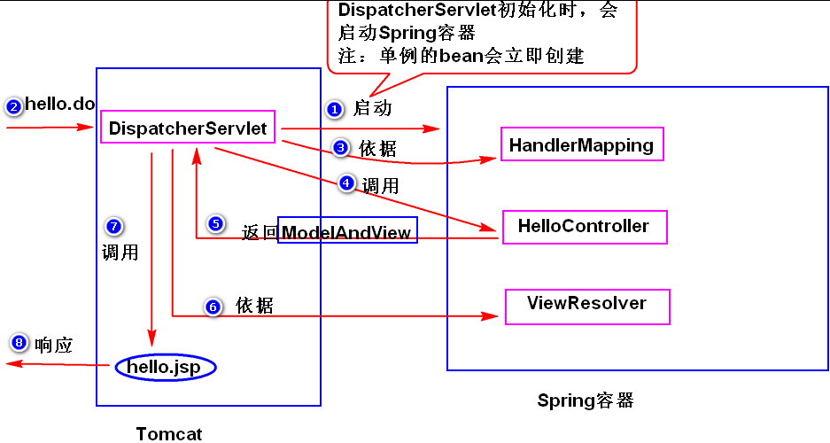

# SSM    
Spring SpringMVC Mybatis  
  
---
## 系统分层
上一层调用接口调用下一层的服务，这样做的好处是，当下一层的实现发生改变，不影响上一层
1. 表示层：UI层，数据展现和操作界面，另外还要负责请求分发
2. 业务层：服务层，封装业务处理逻辑
3. 持久层：数据访问层，封装数据访问逻辑
---
## MVC
<br/>
<br/>
<br/>
软件开发过程中的设计思想，是表示层的一种架构模式
1. Model：封装应用程序的数据结构和事务逻辑，集中体现应用程序的状态
2. View：是 Model 的外在表现，负责提供界面（JSP)
3. Controller：负责协调模型和视图（Servlet）
>### 好处
>1. 方便测试，业务逻辑写在java可直接测试
>2. 方便维护，修改视图、模型，互不影响
>3. 方便分工协作
---
## Spring
解决企业应用开发的复杂性，让J2EE开发更简单
>### Spring 优点:
>1. 轻量级：相对于 EJB 这种重量级的容器而言，Spring 的 IOC 是完全不依赖底层容器，零侵入性的设计。便于开发测试，Spring 部署方便，而且可以运行在任何 J2EE 支持的容器上或 APP 中
>2. 控制反转：Spring 使用控制反转技术实现了松耦合，依赖被注入到对象，而不是创建或寻找依赖对象
>3. 面向切面：解决了面向对象中不足，它将那些影响多个类的行为封装到可重用的模块中，面向对象是把问题从同类事物中抽象出来，面向切面是把问题从不同类问题中抽象出来
>4. 异常处理：由于 Java 的 JDBC，Hibernate 等 API 中有很多方法抛出的是 checked exception，而很多开发者并不能很好的处理异常。Spring 提供了统一的 API 将这些 checked exception 的异常转换成 Spring 的 unchecked exception
>5. Spring MVC：Spring 实现了一个自己的 MVC 框架，性能优越很高，可以替换 struts2，而且无需要考虑与 spring 整合问题
>6. 高度开放性：不强制应用完全依赖于 Spring，开发者可自由选用 Spring 框架的部分或全部
>7. 事务管理：Spring 强大的事务管理功能，支持声明事务和编程事务，能够处理本地事务(一个数据库)或是全局事务
>### Spring 容器
>1. BeanFactory：负责读取 bean 配置文档，管理 bean 的加载，实例化，维护 bean 之间的依赖关系，负责 bean 的声明周期
>2. ApplicationContext：是 BeanFactory 子接口，它提供了比 BeanFactory 更完善的功能
>   1. 继承 MessageSource 接口，因此提供国际化支持
>   2. 资源访问
>   3. 事件机制
>   4. 载入多个配置文件
>   5. 以声明式的方式启动，并创建 Spring 容器
>3. FileSystemXmlApplicationContext：是 ApplicationContext 的子孙类，基于文件系统的 XML 配置文件创建
>4. ClassPathXmlApplicationContext：是 ApplicationContext 的子孙类，以类加载路径下的 XML 配置文件创建  
>>####启动容器实例：
>>```
>>ApplicationContext ac = new ClassPathXmlApplicationContext("spring/spring-service.xml", "spring/spring-aop.xml");
>>```
>### Spring 实例化 Bean
>1. 无参构造器
>```
>   <bean id="gregorianCalendar" class="java.util.GregorianCalendar"/>
>```
>2. 工厂静态方法
>```
>   <bean id="calendar" class="java.util.Calendar" factory-method="getInstance"/>
>```
>3. 工厂实例方法 
>```
>   <bean id="gregorianCalendar" class="java.util.GregorianCalendar"/>
>   <bean id="time" factory-bean="calendar" factory-method="getTime"/>
>```
>### Spring IOC 和 DI
>1. IOC：对象之间的依赖关系由容器来建立，IOC 是目的
>2. DI：容器调用 set() 或构造器来建立对象之间的依赖关系，DI 是手段
>   1. set 注入
>   ```
>   <bean id="date" class="java.util.Date"/>
>   <bean id="student" class="l.demo.Person.Student">
>       <property name="birth" ref="date"/>
>   </bean>
>   ```
>   2. 构造器注入
>   ```
>   <bean id="student2" class="l.demo.Person.Student">
>       <constructor-arg index="0" value="1"/>
>       <constructor-arg index="1" value="张三"/>
>   </bean>
>   ```
>   3. p 命名空间注入：和 set 注入原理一样，都是通过 setter 给属性赋值
>   ```
>   <bean id="student3" class="l.demo.Person.Student" p:id="1" p:name="张三"/>
>   ```
>   4. 自动装配 (autowire)
>       1. no：默认值，禁用自动装配
>       2. byName：根据属性名自动装配
>       3. byType：根据属性类型自动装配
>       4. constructor：与 byType 类似，应用于构造函数
>       5. autodetect：通过 bean 类来决定使用 byType 还是 constructor。如果发现默认的构造器，将使用 byType
>### Spring 参数注入
>1. 基本类型：&lt;property name="age" value="18"/&gt;
>   - 字段属性为 org.springframework.core.io.Resource 时，value="classpath:mybatis-config.xml"
>2. 集合类型：&lt;list/&gt; &lt;set/&gt; &lt;map/&gt; &lt;props/&gt; 或 ref
>   ```
>   <bean id="person" class="l.demo.Person">
>       <property name="otherInfo">
>           <list>
>               <value>父亲</value>
>               <value>医生</value>
>           </list>
>       </property>
>   </bean>
>   
>   <util:properties location="classpath:jdbc.properties" id="jdbc"/>
>   <bean id="properties" class="spring.demo.bean.BeanDemo.Bean">
>       <property name="properties" ref="jdbc"/>
>   </bean>
>   ```
>3. Bean：ref
>4. null：&lt;property name="age"&gt; &lt;null/gt; &lt;/property&gt;
>5. Spring 表达式：#{...}，读取其它对象/集合中的数据
---


